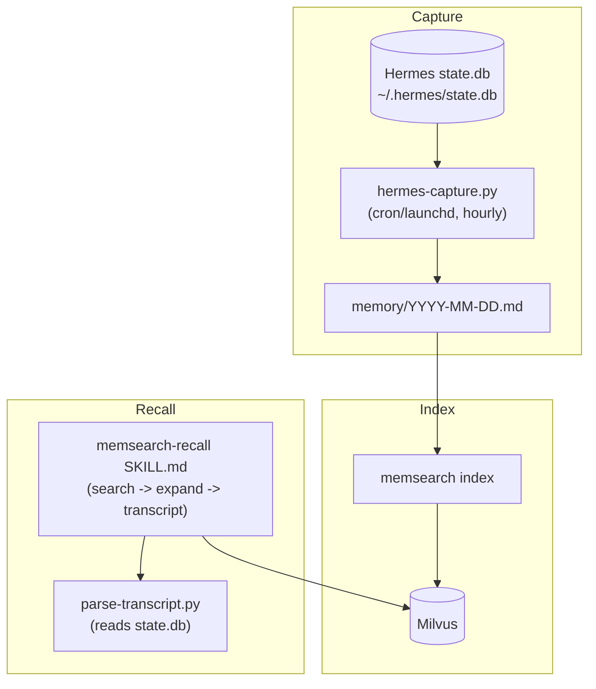

# How It Works

## Architecture



## Capture (state.db poller)

Hermes has no plugin hook system for capture, so the plugin uses a background
poller — the same model as the OpenCode plugin. A cron/launchd job runs
`hermes-capture.py <project> <minutes>`:

1. Reads `~/.hermes/state.db` (`messages` table: `session_id, role, content, timestamp`) for turns newer than the last captured one per session.
2. Appends them to `<project>/.memsearch/memory/YYYY-MM-DD.md` in the shared format:
   ```
   ## Session 09:20
   <!-- hermes session_id:<sid> capture:<msgid> transcript:hermes-state-db -->
   === Transcript of a conversation between User and Hermes ===
   [assistant] ...
   ```
3. Runs `memsearch index .memsearch/memory/ --collection ms_<proj>_<hash>`.

A per-project state file (`.memsearch/hermes-capture-state.json`) prevents duplicate appends.

Because the `.md` files and collection are shared, a turn captured by Hermes is
searchable from Claude Code / OpenCode / Codex in the same project.

## Recall (SKILL.md)

Hermes loads the `memsearch-recall` skill into context. When the user asks a
question with history, the agent runs the three-layer flow:

| Layer | Command |
|-------|---------|
| Search | `memsearch search "<query>" --top-k 5 --collection <col>` |
| Expand | `memsearch expand <hash> --collection <col>` |
| Transcript | `python3 .memsearch/scripts/parse-transcript.py <session_id> --turn <id>` |

## Differences from the OpenCode plugin

| | OpenCode | Hermes |
|---|----------|--------|
| Capture trigger | background daemon (10s) | hourly cron/launchd |
| Tool registration | `tool()` API (TS) | SKILL.md recall |
| Session store | `~/.local/share/opencode/opencode.db` | `~/.hermes/state.db` |